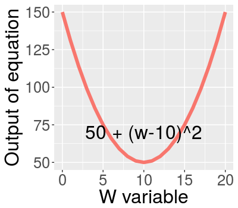

## Residual sum of squares (cost function)


---

## Minimizing RSS
$$ \min_{w_0,w_1}\sum_{i=1}^{N}(y_i - [w_0 + w_{1}x_i])^2 $$
Finding minimum of a sample equation with respect to w:
$$ y = 50 + (w-10)^2 $$

<div class="rimage center"></div>

---

## Gradient Descent 

Minimizing  a sample equation:
$$y = 50 + (w-10)^2 $$

First Derivative:

$$ \frac{d(y)}{dw} = 2(w-10) $$  

<div class="rimage center"></div>

--- 

## Example of varying parameter and gradient in RStudio


```r
library(manipulate)
RSSmin <- function(W_v){
  w = seq(0,20)
  parabola = data.frame(input = w, parabola = 50 + (w-10)^2, derivative = 2*(w-10))
  ggplot(data = parabola, aes(x=input, y=parabola,color = "red")) + 
    guides(colour=FALSE) +
   geom_line(size = 2)  +
  xlab("W variable") + ylab("Output of equation") + 
    theme(text = element_text(size=23),
          plot.title = element_text(size = rel(1)))  +
    annotate("text", x = 10, y = 25, label = paste("2*(w-10) =",
                                                   as.character(2*(W_v-10))), size = 6) +
    annotate("text", x = 10, y = 100, label = paste("RSS = ",
                                                   as.character(50+(W_v-10)^2)), size = 6)
}
manipulate(RSSmin(W_v), W_v = slider(5, 15, step = 0.5))
```

---

## Gradient Descent 

$$ w_i = w_{i-1} - \zeta\times{}\nabla(\color{blue}{\textit{RSS}}) $$

Remember from before that RSS is given by:

$$\textit{RSS} = \sum_{i=1}^{N}(y_i - [\color{blue}{w_0} + \color{blue}{w_{1}}x_i])^2 $$

Taking derivative w.r.t $w_0$ :

$$ -2\sum_{i=1}^{N}(y_i - [w_0 + w_{1}x_i]) $$

Taking derivative w.r.t $w_1$ :

$$ -2\sum_{i=1}^{N}(y_i - [w_0 + w_{1}x_i])x_i $$

---

## Summarising Gradient Descent algorithm

$$ \nabla\textit{RSS}(\color{blue}{w_0},\color{blue}{w_1}) = \begin{bmatrix}-2\sum_{i=1}^{N}(y_i - [\color{blue}{w_0} + \color{blue}{w_{1}}x_i]) \\ -2\sum_{i=1}^{N}(y_i - [\color{blue}{w_0} + \color{blue}{w_{1}}x_i])x_i \end{bmatrix} $$

While not congverged:

$$ \begin{bmatrix}w_0^{(t+1)} \\ w_1^{(t+1)} \end{bmatrix} = \begin{bmatrix}w_0^{(t)} \\ w_1^{(t)} \end{bmatrix} - \color{blue}{\nabla\textit{RSS}(w_0^{(t)},w_1^{(t)})} $$

Convergence condition?


