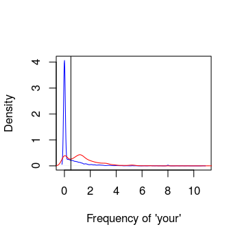

<style>
em {
  font-style: italic
}
</style>

## Topics

- Linear Algebra
- Statistics
- Programming (R/Python/Scala)
- Visualization (ggplot2, D3.js, Tableau)
- Feature Selection
- Hypothesis testing
- Machine learning (Regression, Classification, Recommender Systems, Clustering, Deep learning)
- Reproducible documentation
- Big data (MapReduce, hadoop, Spark, Mesos/Yarn, ...)

---

## Data Science Demand (LinkedIn Top skills)


---

## Data Science Demand (Gartner 2013)


http://www.gartner.com/newsroom/id/2575515

---

## Data Science Demand (Gartner 2014)


http://www.gartner.com/newsroom/id/2819918 

---

## Data Science Demand (Gartner 2015)


ref: http://www.gartner.com/newsroom/id/3114217 

---

## Data Science Demand (Gartner 2016)


http://www.gartner.com/newsroom/id/3412017 

---

## General Skill set


http://blogs.gartner.com/christi-eubanks/three-lessons-crossfit-taught-data-science1 

---

## Type of Data Scientists


http://blog.udacity.com/2014/11/data-science-job-skills.html 

---

## Roadmap to Data Science

<div class="rimage center"></div>
<small>ref: http://nirvacana.com/thoughts/becoming-a-data-scientist/</small>

---

## Data Science ToolBox

- R programming language
- Python Language
- R Markdown, Knitr, Slidify, Shiny
- IPython notebooks

---

## Jeff HammerBach's Model for Data problems

- Identify problem
- Instrument data sources
- Collect data
- Prepare data (integrate, transform, clean, filter, aggregate)
- Build model
- Evaluate model
- Communicate results

---

## Our first Data science project!

</br>

<center> question -> input data -> features -> algorithm -> parameters -> evaluation  </center>


---

## SPAM Example

</br>

<center> <font color="red"> question</font> -> input data -> features -> algorithm -> parameters -> evaluation  </center>

</br>

<b>Start with a general question </b>

Can I automatically detect emails that are SPAM that are not?

<b> Make it concrete </b>

Can I use quantitative characteristics of the emails to classify them as SPAM/HAM?


---

## SPAM Example

</br>

<center> question -> <font color="red">input data </font> -> features -> algorithm -> parameters -> evaluation  </center>


[http://rss.acs.unt.edu/Rdoc/library/kernlab/html/spam.html](http://rss.acs.unt.edu/Rdoc/library/kernlab/html/spam.html)


---

## SPAM Example

</br>

<center> question -> input data  -> <font color="red">features</font> -> algorithm -> parameters -> evaluation  </center>

</br>


<b>
Dear Sir, 

Can you send me your address so I can send you the invitation? 

Thanks,

Ahsan
</b>


---

## SPAM Example

</br>

<center> question -> input data  -> <font color="red">features</font> -> algorithm -> parameters -> evaluation  </center>

</br>

<b> 

Dear Sir, 

Can <rt>you</rt> send me your address so I can send <rt>you</rt> the invitation? 

Thanks,

Ahsan
</b>

</br>

Frequency of you $= 2/17 = 0.118$

---

## SPAM Example

</br>

<center> question -> input data  -> <font color="red">features</font> -> algorithm -> parameters -> evaluation  </center>


```r
library(kernlab)
data(spam)
head(spam,3)
```

```
  make address  all num3d  our over remove internet order mail receive will people report addresses
1 0.00    0.64 0.64     0 0.32 0.00   0.00     0.00  0.00 0.00    0.00 0.64   0.00   0.00      0.00
2 0.21    0.28 0.50     0 0.14 0.28   0.21     0.07  0.00 0.94    0.21 0.79   0.65   0.21      0.14
3 0.06    0.00 0.71     0 1.23 0.19   0.19     0.12  0.64 0.25    0.38 0.45   0.12   0.00      1.75
  free business email  you credit your font num000 money hp hpl george num650 lab labs telnet
1 0.32     0.00  1.29 1.93   0.00 0.96    0   0.00  0.00  0   0      0      0   0    0      0
2 0.14     0.07  0.28 3.47   0.00 1.59    0   0.43  0.43  0   0      0      0   0    0      0
3 0.06     0.06  1.03 1.36   0.32 0.51    0   1.16  0.06  0   0      0      0   0    0      0
  num857 data num415 num85 technology num1999 parts pm direct cs meeting original project   re  edu
1      0    0      0     0          0    0.00     0  0   0.00  0       0     0.00       0 0.00 0.00
2      0    0      0     0          0    0.07     0  0   0.00  0       0     0.00       0 0.00 0.00
3      0    0      0     0          0    0.00     0  0   0.06  0       0     0.12       0 0.06 0.06
  table conference charSemicolon charRoundbracket charSquarebracket charExclamation charDollar
1     0          0          0.00            0.000                 0           0.778      0.000
2     0          0          0.00            0.132                 0           0.372      0.180
3     0          0          0.01            0.143                 0           0.276      0.184
  charHash capitalAve capitalLong capitalTotal type
1    0.000      3.756          61          278 spam
2    0.048      5.114         101         1028 spam
3    0.010      9.821         485         2259 spam
```


---

## SPAM Example


<center> question -> input data  -> features -> <font color="red">algorithm</font> -> parameters -> evaluation  </center>


```r
plot(density(spam$our[spam$type=="nonspam"]),
     col="blue",main="",xlab="Frequency of 'your'")
lines(density(spam$our[spam$type=="spam"]),col="red")
```

<div class="rimage center"></div>

---

## SPAM Example


<center> question -> input data  -> features -> <font color="red">algorithm</font> -> parameters -> evaluation  </center>

</br></br>

__Our algorithm__

* Find a value $C$. 
* __frequency of 'your' $>$ C__ predict "spam"

---

## SPAM Example


<center> question -> input data  -> features -> algorithm -> <font color="red">parameters</font> -> evaluation  </center>


```r
plot(density(spam$your[spam$type=="nonspam"]),
     col="blue",main="",xlab="Frequency of 'your'")
lines(density(spam$your[spam$type=="spam"]),col="red")
abline(v=0.5,col="black")
```

<div class="rimage center"></div>

---

## SPAM Example


<center> question -> input data  -> features -> algorithm -> parameters -> <font color="red">evaluation</font></center>


```r
prediction <- ifelse(spam$your > 0.5,"spam","nonspam")
table(prediction,spam$type)
```

```
          
prediction nonspam spam
   nonspam    2112  468
   spam        676 1345
```

Accuracy$ \approx 0.459 + 0.292 = 0.751$

---

## Regression

- Linear Regression
- Multiple linear Regression
- Polynomial Regression
- Ridge Regression
- Lasso Regression
- Local/Kernel Regression

---

## Classification problems

- Linear Classifier
- Logistic Regression
- Decision Trees
- Boosting
- Discussion about scaling of algorithms

---

## Feature Selection

- Subset selection
- Greedy passes
- Basis selection
- Bias variance trade-off

---

## Document retrieval and Clustering

- Nearest Neighbor
- K-means clustering
- Hierarchical Clustering
- Latent Dirichlet allocation

---

## Recommender System

- Collaborative Filtering
- SVD and PCA
- Matrix factorization technique

---

## Deep learning

- Examples of cross-learning
- Using deep features for image, text matching

---

## Hypothesis Testing

- Normal distributions to t-distributions
- A/B testing scenarios 
- Real world examples

---

## Reproducible Documents

- R Markdown example, embedding code and text
- IPython 

---

## Big Data Paradigm

- MapReduce
- Hadoop
- Spark
- Mesos/Yarn
- NoSql Databases

